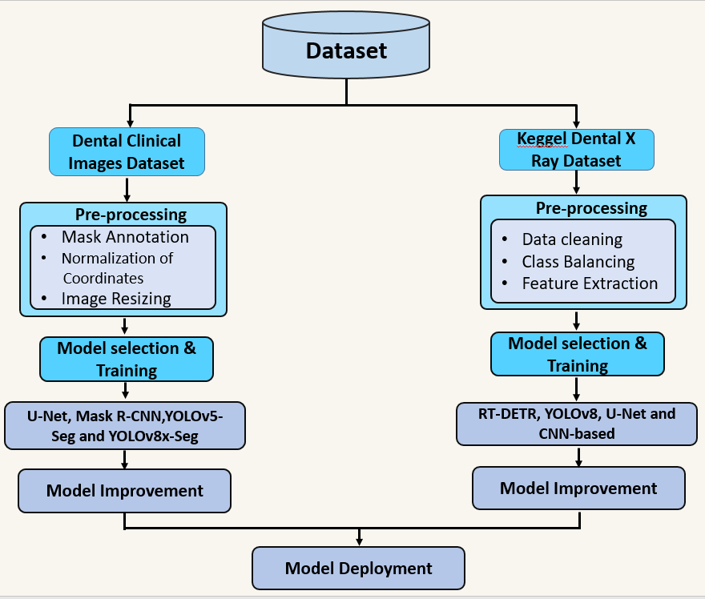
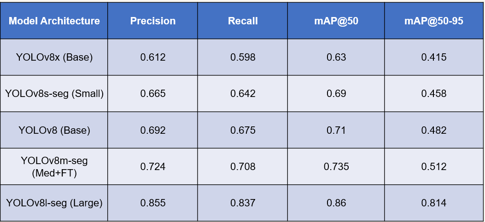
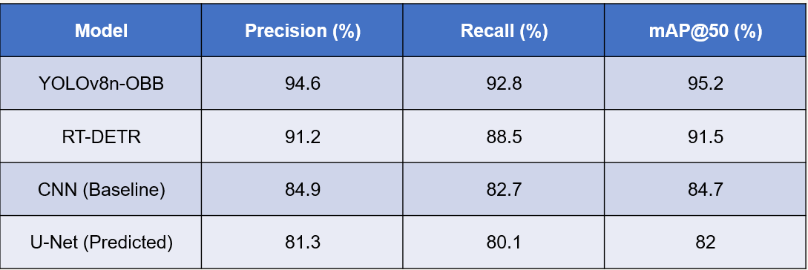

# DentCare AI: Automated Dental Pathologies Detection 🦷

DentCare AI ek advanced diagnostic assistant hai jo Artificial Intelligence (YOLOv8 & RT-DETR) ko use karte hue dental X-rays (OPG) aur clinical images se cavities, fillings, aur impacted teeth detect karta hai. Ye system dentists ko fast aur accurate diagnosis mein madad dene ke liye design kiya gaya hai.

## 🛠️ Project Architecture & Methodology
Is project mein dual-pipeline approach use ki gayi hai:
1. **Clinical Stream:** Visible dental issues ke liye instance segmentation.
2. **Radiograph (X-ray) Stream:** OPG images se deep-seated issues ki detection.

*Figure 1: Deep Learning Pipeline for Dental Medical Imaging*

## 📊 Results & Performance
Humne different YOLOv8 variants aur RT-DETR ko compare kiya taake best accuracy hasil ho sake.

### 1. Clinical Dataset (Instance Segmentation)
Clinical images par **YOLOv8l-seg** ne sab se behtareen results diye:

| Model Architecture | Precision | Recall | mAP@50 |
| :--- | :--- | :--- | :--- |
| **YOLOv8l-seg (Large)** | **0.855** | **0.837** | **0.860** |
| YOLOv8m-seg | 0.724 | 0.708 | 0.735 |

### 2. X-ray (OPG) Dataset (Detection)
X-ray analysis ke liye **YOLOv8n-OBB** (Oriented Bounding Boxes) sab se fast aur accurate raha:

| Model | Precision (%) | Recall (%) | mAP@50 (%) |
| :--- | :--- | :--- | :--- |
| **YOLOv8n-OBB** | **94.6%** | **92.8%** | **95.2%** |
| RT-DETR | 91.2% | 88.5% | 91.5% |

## 🚀 Key Features
- **Dual-Mode Detection:** Clinical aur OPG dono types ki images support karta hai.
- **High Precision:** X-rays par **95.2% mAP** achieve kiya gaya.
- **Real-time Inference:** Fast processing taake clinical environment mein use ho sake.
- **Full-Stack Integration:** Backend (Flask/Django) aur Frontend (React Native/Web) ke sath complete system.

## 📂 Repository Structure
- `backend/`: API integration aur Model inference code.
- `frontend/`: User interface aur dashboard code.
- `models/`: Trained `.pt` weights (YOLOv8 variants).
- `docs/`: Methodology diagrams aur detailed results.
- `app.py`: Main application script.

---
**Developed by Umar Ayoub** *Final Year Project (AI Specialization) - UET Mardan*